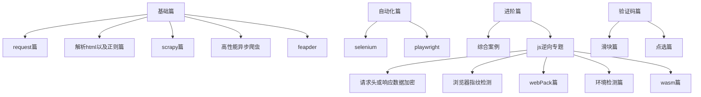

# 爬虫项目实战

## 说明

所有项目均为作者**练手分享项目**，如遇**侵权请联系删除**，仅作**学习分享**，**不能进行任何商业活动**。

由于程序完成的**时间问题**，部分项目可能**无法复用**。

练习笔记见**note.txt**

_此项目将持续更新_

项目部分实战讲解见b站：https://space.bilibili.com/35242527/channel/collectiondetail?sid=1590251

**下面是个人对于网站爬取难度评级**

| 难度等级 | 表示   | 补充     |
|------|------|--------|
| 骑士侍从 | 0    | 入门     |
| 准骑士  | 00   | 踏过门槛了  |
| 骑士   | *    | 初级     |
| 大骑士  | **   | 比初级高一点 |
| 大地骑士 | ***  | 中等难度   |
| 辉耀骑士 | +    | 中上难度   |
| 圣殿骑士 | ++   | 比较难    |
| 圣骑士  | +++  | 难      |
| 神印骑士 | KING | 地狱     |

### 项目目录



> 项目所用到的第三方库
>

 ```bash
 pip install requests # requests库，爬虫的开始
 pip install curl_cffi # 标准tls请求库
 pip install lxml # xpath提取数据
 pip install playwright # 自动化需要
 pip install ddddocr # 识别验证码
 pip install selenium # 自动化需要，推荐playwright
 pip install scrapy # 爬虫框架
 pip install "feapder[all]" # 新一代爬虫框架
 pip install pycryptodome # python标准密码库
 pip install pyexecjs2 # python调用js代码
 pip install m3u8 # 下载m3u8视频
 pip install prettytable # 格式化输出
 pip install tqdm # 进度条
 pip install loguru # 强大的日志工具库
 pip install retrying # 强大的重试工具
 npm install crypto-js/cryptojs # 二选一，js标准密码库
 npm insatll jsdom # js模拟浏览器的dom和bom
 npm insatll tough-cookie # 浏览器cookie
```

## 基础篇

### request篇

| 难度标识 | 项目名     | 补充       | 快捷导航                                                                                            |
|------|---------|----------|-------------------------------------------------------------------------------------------------|
| 骑士侍从 | 百度网页    | 第一个爬虫程序  | [点这里](https://github.com/xishandong/crawlProject/tree/main/%E5%9F%BA%E7%A1%80%E7%AF%87/request) |
| 骑士侍从 | ua识别    | 初始反爬     | [点这里](https://github.com/xishandong/crawlProject/tree/main/%E5%9F%BA%E7%A1%80%E7%AF%87/request) |
| 骑士侍从 | 百度翻译    | 认识post请求 | [点这里](https://github.com/xishandong/crawlProject/tree/main/%E5%9F%BA%E7%A1%80%E7%AF%87/request) |
| 骑士侍从 | 豆瓣电影    | 基础       | [点这里](https://github.com/xishandong/crawlProject/tree/main/%E5%9F%BA%E7%A1%80%E7%AF%87/request) |
| 骑士侍从 | 肯德基位置查询 | json练习   | [点这里](https://github.com/xishandong/crawlProject/tree/main/%E5%9F%BA%E7%A1%80%E7%AF%87/request) |

### 解析html以及正则篇

| 难度标识 | 项目名      | 补充             | 快捷导航                                                                                              |
|------|----------|----------------|---------------------------------------------------------------------------------------------------|
| 准骑士  | 获取fakeua | lxml解析         | [点这里](https://github.com/xishandong/crawlProject/tree/main/%E5%9F%BA%E7%A1%80%E7%AF%87/lxml%26re) |
| 准骑士  | 4k图片爬取   | lxml以及解决编码错误问题 | [点这里](https://github.com/xishandong/crawlProject/tree/main/%E5%9F%BA%E7%A1%80%E7%AF%87/lxml%26re) |
| 准骑士  | 58       | lxml以及分页爬取     | [点这里](https://github.com/xishandong/crawlProject/tree/main/%E5%9F%BA%E7%A1%80%E7%AF%87/lxml%26re) |
| 准骑士  | bs基础     | 初始bs           | [点这里](https://github.com/xishandong/crawlProject/tree/main/%E5%9F%BA%E7%A1%80%E7%AF%87/lxml%26re) |
| 准骑士  | bs案例     | 实战bs           | [点这里](https://github.com/xishandong/crawlProject/tree/main/%E5%9F%BA%E7%A1%80%E7%AF%87/lxml%26re) |
| 准骑士  | xpath基础  | 初始xpath        | [点这里](https://github.com/xishandong/crawlProject/tree/main/%E5%9F%BA%E7%A1%80%E7%AF%87/lxml%26re) |
| 准骑士  | xpath解析  | 练习xpath        | [点这里](https://github.com/xishandong/crawlProject/tree/main/%E5%9F%BA%E7%A1%80%E7%AF%87/lxml%26re) |
| 准骑士  | 正则基础     | 初始正则           | [点这里](https://github.com/xishandong/crawlProject/tree/main/%E5%9F%BA%E7%A1%80%E7%AF%87/lxml%26re) |
| 准骑士  | 正则练习     | 实战正则           | [点这里](https://github.com/xishandong/crawlProject/tree/main/%E5%9F%BA%E7%A1%80%E7%AF%87/lxml%26re) |
| 准骑士  | 简历爬取     | 以上的小综合         | [点这里](https://github.com/xishandong/crawlProject/tree/main/%E5%9F%BA%E7%A1%80%E7%AF%87/lxml%26re) |

### scrapy篇

| 难度标识 | 项目名     | 补充                          | 快捷导航                                                                                           |
|------|---------|-----------------------------|------------------------------------------------------------------------------------------------|
| 大骑士  | bossjob | 一级页面爬取，可能不可用                | [点这里](https://github.com/xishandong/crawlProject/tree/main/%E5%9F%BA%E7%A1%80%E7%AF%87/scrapy) |
| 大骑士  | 双色球     | 都是基本scrapy操作                | [点这里](https://github.com/xishandong/crawlProject/tree/main/%E5%9F%BA%E7%A1%80%E7%AF%87/scrapy) |
| 大骑士  | 图片      | 都是基本scrapy操作                | [点这里](https://github.com/xishandong/crawlProject/tree/main/%E5%9F%BA%E7%A1%80%E7%AF%87/scrapy) |
| 大骑士  | 阳光政策    | 都是基本scrapy操作                | [点这里](https://github.com/xishandong/crawlProject/tree/main/%E5%9F%BA%E7%A1%80%E7%AF%87/scrapy) |
| 大骑士  | yi车数据爬取 | 带有js逆向，不过是入门级，以及大批量json数据解析 | [点这里](https://github.com/xishandong/crawlProject/tree/main/%E5%9F%BA%E7%A1%80%E7%AF%87/scrapy) |
| 大骑士  | 校花网     | 都是基本scrapy操作                | [点这里](https://github.com/xishandong/crawlProject/tree/main/%E5%9F%BA%E7%A1%80%E7%AF%87/scrapy) |
| 大骑士  | 网易新闻    | 都是基本scrapy操作                | [点这里](https://github.com/xishandong/crawlProject/tree/main/%E5%9F%BA%E7%A1%80%E7%AF%87/scrapy) |
| 大骑士  | 17k小说爬取 | 都是基本scrapy操作                | [点这里](https://github.com/xishandong/crawlProject/tree/main/%E5%9F%BA%E7%A1%80%E7%AF%87/scrapy) |

### 高性能异步爬虫

| 难度标识 | 项目名         | 补充   | 快捷导航                                                                                                                                                    |
|------|-------------|------|---------------------------------------------------------------------------------------------------------------------------------------------------------|
| 骑士侍从 | 认识flask     | 基础知识 | [点这里](https://github.com/xishandong/crawlProject/tree/main/%E5%9F%BA%E7%A1%80%E7%AF%87/%E9%AB%98%E6%80%A7%E8%83%BD%E5%BC%82%E6%AD%A5%E7%88%AC%E8%99%AB) |
| 骑士   | 线程池基础       | 基础知识 | [点这里](https://github.com/xishandong/crawlProject/tree/main/%E5%9F%BA%E7%A1%80%E7%AF%87/%E9%AB%98%E6%80%A7%E8%83%BD%E5%BC%82%E6%AD%A5%E7%88%AC%E8%99%AB) |
| 大骑士  | meinv图片批量爬取 | 基础   | [点这里](https://github.com/xishandong/crawlProject/tree/main/%E5%9F%BA%E7%A1%80%E7%AF%87/%E9%AB%98%E6%80%A7%E8%83%BD%E5%BC%82%E6%AD%A5%E7%88%AC%E8%99%AB) |
| 大骑士  | 明星图片爬取      | 基础   | [点这里](https://github.com/xishandong/crawlProject/tree/main/%E5%9F%BA%E7%A1%80%E7%AF%87/%E9%AB%98%E6%80%A7%E8%83%BD%E5%BC%82%E6%AD%A5%E7%88%AC%E8%99%AB) |
| 大骑士  | 多任务协程       | 基础   | [点这里](https://github.com/xishandong/crawlProject/tree/main/%E5%9F%BA%E7%A1%80%E7%AF%87/%E9%AB%98%E6%80%A7%E8%83%BD%E5%BC%82%E6%AD%A5%E7%88%AC%E8%99%AB) |
| 大骑士  | 线程池应用       | 基础   | [点这里](https://github.com/xishandong/crawlProject/tree/main/%E5%9F%BA%E7%A1%80%E7%AF%87/%E9%AB%98%E6%80%A7%E8%83%BD%E5%BC%82%E6%AD%A5%E7%88%AC%E8%99%AB) |

### feapder
| 难度标识     | 项目名     | 补充                                                  | 快捷导航                                                                                            |
|----------|---------|-----------------------------------------------------|-------------------------------------------------------------------------------------------------|
| 辉耀骑士     | 小红书数据采集    | 使用air模式的feapder，自定义csv储存管道，未来会以更多模式改写，以及更多功能加入，还迎补充 | [点这里](https://github.com/xishandong/crawlProject/tree/main/feapder%E7%AF%87) |
## 自动化篇

### selenium

| 难度标识 | 项目名          | 补充      | 快捷导航                                                                                                      |
|------|--------------|---------|-----------------------------------------------------------------------------------------------------------|
| 骑士侍从 | 基础自动操作       | 基本自动化操作 | [点这里](https://github.com/xishandong/crawlProject/tree/main/%E8%87%AA%E5%8A%A8%E5%8C%96%E7%AF%87/selenium) |
| 骑士侍从 | 模拟登陆         | 练习自动化   | [点这里](https://github.com/xishandong/crawlProject/tree/main/%E8%87%AA%E5%8A%A8%E5%8C%96%E7%AF%87/selenium) |
| 骑士侍从 | 动作链和ifream处理 | 练习自动化   | [点这里](https://github.com/xishandong/crawlProject/tree/main/%E8%87%AA%E5%8A%A8%E5%8C%96%E7%AF%87/selenium) |
| 骑士侍从 | 无头浏览器和反检测    | 练习      | [点这里](https://github.com/xishandong/crawlProject/tree/main/%E8%87%AA%E5%8A%A8%E5%8C%96%E7%AF%87/selenium) |
| 骑士   | 12306模拟登录    | 多半不可用   | [点这里](https://github.com/xishandong/crawlProject/tree/main/%E8%87%AA%E5%8A%A8%E5%8C%96%E7%AF%87/selenium) |
| 骑士   | damai网       | 多半不可用   | [点这里](https://github.com/xishandong/crawlProject/tree/main/%E8%87%AA%E5%8A%A8%E5%8C%96%E7%AF%87/selenium) |

### playwright

| 难度标识 | 项目名          | 补充                                                                                                                    | 快捷导航                                                                                                        |
|------|--------------|-----------------------------------------------------------------------------------------------------------------------|-------------------------------------------------------------------------------------------------------------|
| 骑士   | 邮政编码         | 通过地址查询邮政编码，使用同步方式，包含等待操作以及根据情况选择不同的表格，同时使用pandas对excel文件进行操作                                                          | [点这里](https://github.com/xishandong/crawlProject/tree/main/%E8%87%AA%E5%8A%A8%E5%8C%96%E7%AF%87/playwright) |
| 大骑士  | 采用本地浏览器进行反爬虫 | 我们使用自动化时有时会被检测，我们这里使用本地浏览器进行反爬虫，并且由于是本地浏览器，我们的session状态和cookie状态都是存在的，也就是说原本登录过的网站我们访问直接就是登录状态了，可以方便很多，不需要我们创建浏览器的上下文 | [点这里](https://github.com/xishandong/crawlProject/tree/main/%E8%87%AA%E5%8A%A8%E5%8C%96%E7%AF%87/playwright) |
| 大地骑士 | 采集资料         | 通过网站名采集网站的邮箱电话地址社交媒体链接，难点在于每个网站风格完全不一，所有数据也不一并且数量很大，写正则很不好写，处理异步也比较麻烦，仓库只列举了其中10个页面，需要编写者对正则以及异步playwright有一定的了解      | [点这里](https://github.com/xishandong/crawlProject/tree/main/%E8%87%AA%E5%8A%A8%E5%8C%96%E7%AF%87/playwright) |
| 大骑士  | 反检测浏览器       | 通过大牛的js文件创建一个反检测的浏览器，可以绕过绝大部分的检测                                                                                      | [点这里](https://github.com/xishandong/crawlProject/tree/main/%E8%87%AA%E5%8A%A8%E5%8C%96%E7%AF%87/playwright) |
| 大地骑士 | 起点vip小说爬取    | 通过屏幕快照的方式绕过起点vip小说的css反爬，用到的知识点有：定位盒子，截图，滑动，处理边界，合并截图。此方案不是最优解，欢迎大家补充                                                 | [点这里](https://github.com/xishandong/crawlProject/tree/main/%E8%87%AA%E5%8A%A8%E5%8C%96%E7%AF%87/playwright) |

## 进阶篇

### 综合案例

***

| 难度标识 | 项目名          | 补充                                                                                                                                                                          | 快捷导航                                                                                                                         |
|------|--------------|-----------------------------------------------------------------------------------------------------------------------------------------------------------------------------|------------------------------------------------------------------------------------------------------------------------------|
| 骑士   | 某诗文网         | 验证码相关，登录以及图片验证码解决 --- ddddocr                                                                                                                                               | [点这里](https://github.com/xishandong/crawlProject/tree/main/%E8%BF%9B%E9%98%B6%E7%AF%87/%E5%9F%BA%E7%A1%80%E7%BB%BC%E5%90%88) |
| 大骑士  | 语言爬虫         | 利用网络将文本转为语言，支持中英韩三国语言                                                                                                                                                       | [点这里](https://github.com/xishandong/crawlProject/tree/main/%E8%BF%9B%E9%98%B6%E7%AF%87/%E5%9F%BA%E7%A1%80%E7%BB%BC%E5%90%88) |
| 大骑士  | b站综合         | 检查用户是否给你点赞，拉去消息列表，拉取点赞列表                                                                                                                                                    | [点这里](https://github.com/xishandong/crawlProject/tree/main/%E8%BF%9B%E9%98%B6%E7%AF%87/%E5%9F%BA%E7%A1%80%E7%BB%BC%E5%90%88) |
| 大地骑士 | 某视频网站        | m3u8视频下载，解决带密钥以及不带密钥情况，m3u8入门级别以及多线程下载                                                                                                                                      | [点这里](https://github.com/xishandong/crawlProject/tree/main/%E8%BF%9B%E9%98%B6%E7%AF%87/%E5%9F%BA%E7%A1%80%E7%BB%BC%E5%90%88) |
| 大地骑士 | ins爬虫        | 对于页面参数提取以及解析json文件                                                                                                                                                          | [点这里](https://github.com/xishandong/crawlProject/tree/main/%E8%BF%9B%E9%98%B6%E7%AF%87/%E5%9F%BA%E7%A1%80%E7%BB%BC%E5%90%88) |
| 大地骑士 | douyin全站数据爬取 | 包括视频图片下载，评论爬取，用户信息爬取...   目前部分接口也开始x-b检测了，如果需要用到被检测接口，则需要加上x-b才可以获取数据, 现在重新整合签名，大家在github找到获取签名的js文件即可，放到douyin文件同目录下命名为x-b.js即可, up提供了一个在github上别人开源的代码仓库，在代码中标志了仓库，目前可以使用 | [点这里](https://github.com/xishandong/crawlProject/tree/main/%E8%BF%9B%E9%98%B6%E7%AF%87/%E5%9F%BA%E7%A1%80%E7%BB%BC%E5%90%88) |
| 大地骑士 | weibo全站数据爬取  | 包括搜索用户，搜索帖子，下载评论，下载用户相册，用户主页，用户信息...                                                                                                                                        | [点这里](https://github.com/xishandong/crawlProject/tree/main/%E8%BF%9B%E9%98%B6%E7%AF%87/%E5%9F%BA%E7%A1%80%E7%BB%BC%E5%90%88) |
| 未知等级 | 爬虫轮子 | 个人对常用的爬虫方法进行二次封装，方便后期开发 |[点这里](https://github.com/xishandong/crawlProject/tree/main/%E8%BF%9B%E9%98%B6%E7%AF%87/%E5%9F%BA%E7%A1%80%E7%BB%BC%E5%90%88) |
### js逆向专题

***

#### 请求头或响应数据加密

| 难度标识 | 项目名         | 补充                     | 快捷导航                                                                                                                                                                                  |
|------|-------------|------------------------|---------------------------------------------------------------------------------------------------------------------------------------------------------------------------------------|
| 骑士   | 烯牛数据        | 请求头加密，响应体加密            | [点这里](https://github.com/xishandong/crawlProject/tree/main/%E8%BF%9B%E9%98%B6%E7%AF%87/js%E9%80%86%E5%90%91/%E8%AF%B7%E6%B1%82%E5%A4%B4%E8%AF%B7%E6%B1%82%E4%BD%93%E5%8A%A0%E5%AF%86) |
| 骑士   | 娱乐指数        | 基础入门                   | [点这里](https://github.com/xishandong/crawlProject/tree/main/%E8%BF%9B%E9%98%B6%E7%AF%87/js%E9%80%86%E5%90%91/%E8%AF%B7%E6%B1%82%E5%A4%B4%E8%AF%B7%E6%B1%82%E4%BD%93%E5%8A%A0%E5%AF%86) |
| 骑士   | 艺恩数据        | 响应体加密                  | [点这里](https://github.com/xishandong/crawlProject/tree/main/%E8%BF%9B%E9%98%B6%E7%AF%87/js%E9%80%86%E5%90%91/%E8%AF%B7%E6%B1%82%E5%A4%B4%E8%AF%B7%E6%B1%82%E4%BD%93%E5%8A%A0%E5%AF%86) |
| 骑士   | 行行查         | 响应体加密                  | [点这里](https://github.com/xishandong/crawlProject/tree/main/%E8%BF%9B%E9%98%B6%E7%AF%87/js%E9%80%86%E5%90%91)                                                                          |
| 大骑士  | fjs公共交易     | 混淆参数加密                 | [点这里](https://github.com/xishandong/crawlProject/tree/main/%E8%BF%9B%E9%98%B6%E7%AF%87/js%E9%80%86%E5%90%91/%E8%AF%B7%E6%B1%82%E5%A4%B4%E8%AF%B7%E6%B1%82%E4%BD%93%E5%8A%A0%E5%AF%86) |
| 大骑士  | 唯一艺术        | 动态js运行代码               | [点这里](https://github.com/xishandong/crawlProject/tree/main/%E8%BF%9B%E9%98%B6%E7%AF%87/js%E9%80%86%E5%90%91/%E8%AF%B7%E6%B1%82%E5%A4%B4%E8%AF%B7%E6%B1%82%E4%BD%93%E5%8A%A0%E5%AF%86) |
| 大地骑士 | 某天气网站       | 动态js 动态key 动态参数 反debug | [点这里](https://github.com/xishandong/crawlProject/tree/main/%E8%BF%9B%E9%98%B6%E7%AF%87/js%E9%80%86%E5%90%91/%E8%AF%B7%E6%B1%82%E5%A4%B4%E8%AF%B7%E6%B1%82%E4%BD%93%E5%8A%A0%E5%AF%86) |
| 大地骑士 | 某足球网站       | 请求体多重加密，加密位置难定位        | [点这里](https://github.com/xishandong/crawlProject/tree/main/%E8%BF%9B%E9%98%B6%E7%AF%87/js%E9%80%86%E5%90%91/%E8%AF%B7%E6%B1%82%E5%A4%B4%E8%AF%B7%E6%B1%82%E4%BD%93%E5%8A%A0%E5%AF%86) |
| 大地骑士 | wangyiyun音乐 | 实现全站数据爬取               | [点这里](https://github.com/xishandong/crawlProject/tree/main/%E8%BF%9B%E9%98%B6%E7%AF%87/js%E9%80%86%E5%90%91/%E8%AF%B7%E6%B1%82%E5%A4%B4%E8%AF%B7%E6%B1%82%E4%BD%93%E5%8A%A0%E5%AF%86) |
| 大地骑士 | gds公共交易     | 混淆参数，需要找定位             | [点这里](https://github.com/xishandong/crawlProject/tree/main/%E8%BF%9B%E9%98%B6%E7%AF%87/js%E9%80%86%E5%90%91/%E8%AF%B7%E6%B1%82%E5%A4%B4%E8%AF%B7%E6%B1%82%E4%BD%93%E5%8A%A0%E5%AF%86) |
| 大地骑士 | 某道翻译        | 请求加密响应解密，难度不大          | [点这里](https://github.com/xishandong/crawlProject/tree/main/%E8%BF%9B%E9%98%B6%E7%AF%87/js%E9%80%86%E5%90%91/%E8%AF%B7%E6%B1%82%E5%A4%B4%E8%AF%B7%E6%B1%82%E4%BD%93%E5%8A%A0%E5%AF%86) |
| 大地骑士 | b站登录 | rsa加密密码，极验三代文字点选，文字点选部分可见验证码篇 | [点这里](https://github.com/xishandong/crawlProject/tree/main/%E8%BF%9B%E9%98%B6%E7%AF%87/js%E9%80%86%E5%90%91/%E8%AF%B7%E6%B1%82%E5%A4%B4%E8%AF%B7%E6%B1%82%E4%BD%93%E5%8A%A0%E5%AF%86)|
#### webPack

| 难度标识 | 项目名     | 补充                                               | 快捷导航                                                                                                                 |
|------|---------|--------------------------------------------------|----------------------------------------------------------------------------------------------------------------------|
| 大地骑士 | china五矿 | 基础webpack，标准版加密算法，简单，可用多种方式实现（nodejs,python和扣代码） | [点这里](https://github.com/xishandong/crawlProject/tree/main/%E8%BF%9B%E9%98%B6%E7%AF%87/js%E9%80%86%E5%90%91/webPack) |

#### 环境检测

| 难度标识 | 项目名                               | 补充                                                       | 快捷导航                                                                                                                                              |
|------|-----------------------------------|----------------------------------------------------------|---------------------------------------------------------------------------------------------------------------------------------------------------|
| 辉耀骑士 | redBook                           | xhs x-s环境检测，需要自己把cookie和localstorage放到文件中                | [点这里](https://github.com/xishandong/crawlProject/tree/main/%E8%BF%9B%E9%98%B6%E7%AF%87/js%E9%80%86%E5%90%91/%E7%8E%AF%E5%A2%83%E6%A3%80%E6%B5%8B) |
| 辉耀骑士 | bossjob                           | __zp_s...__环境检测，每天js都不同，需要补一些环境，并且修改js，有一个module检测等...   | [点这里](https://github.com/xishandong/crawlProject/tree/main/%E8%BF%9B%E9%98%B6%E7%AF%87/js%E9%80%86%E5%90%91/%E7%8E%AF%E5%A2%83%E6%A3%80%E6%B5%8B) |
| 辉耀骑士 | 猿人学2023第一题                        | 魔改md5和aes 删除部分蜜罐，补充浏览器环境即可                               | [点这里](https://github.com/xishandong/crawlProject/tree/main/%E8%BF%9B%E9%98%B6%E7%AF%87/js%E9%80%86%E5%90%91/%E7%8E%AF%E5%A2%83%E6%A3%80%E6%B5%8B) |
| 大地骑士 | 饿了么参数                             | 通过playwright获取bx_et参数                                    | [点这里](https://github.com/xishandong/crawlProject/tree/main/%E8%BF%9B%E9%98%B6%E7%AF%87/js%E9%80%86%E5%90%91/%E7%8E%AF%E5%A2%83%E6%A3%80%E6%B5%8B) |
| 辉耀骑士 | pdd的anti_content参数                | 这个不是补环境，是扣的算法，pdd不同站点其实加密大概差不多，有些对象的值有所差别而已，加密的主函数都是一个逻辑 | [点这里](https://github.com/xishandong/crawlProject/tree/main/%E8%BF%9B%E9%98%B6%E7%AF%87/js%E9%80%86%E5%90%91/%E7%8E%AF%E5%A2%83%E6%A3%80%E6%B5%8B) |
| 大地骑士 | 更新boss直聘物品点选解ip封锁，坐标识别就随便在网上找了一个了 | 这个点选轨迹加密就是极验三代 | 更新在boss那个文件里面了                                                                                                                                    |
#### wasm加密

| 难度标识 | 项目名 | 补充                                                          | 快捷导航                                                                                                                  |
|------|-----|-------------------------------------------------------------|-----------------------------------------------------------------------------------------------------------------------|
| 辉耀骑士 | 某航空 | wasm操作内容实现加密解密 请求头参数加密更新 阿里系v2检测 阿里系v3检测(自动化获取)，至此所有加密参数已解决 | [点这里](https://github.com/xishandong/crawlProject/tree/main/%E8%BF%9B%E9%98%B6%E7%AF%87/js%E9%80%86%E5%90%91/wasm/air) |

#### 浏览器指纹检测

| 难度标识 | 项目名 | 补充                                 | 快捷导航                                                                                                                                                                                                     |
|------|-----|------------------------------------|----------------------------------------------------------------------------------------------------------------------------------------------------------------------------------------------------------|
| 大地骑士 | 易九批 | 首先是加密请求体，其次是tls指纹检测，目前使用第三方库过了主页请求 | [点这里](https://github.com/xishandong/crawlProject/tree/main/%E8%BF%9B%E9%98%B6%E7%AF%87/js%E9%80%86%E5%90%91/%E6%B5%8F%E8%A7%88%E5%99%A8%E6%8C%87%E7%BA%B9%E6%A3%80%E6%B5%8B/%E6%98%93%E4%B9%9D%E6%89%B9) |

## 验证码篇

### 滑块篇

| 难度标识 | 项目名       | 补充                                                                                                                              | 快捷导航                                                                                                                                              |
|------|-----------|---------------------------------------------------------------------------------------------------------------------------------|---------------------------------------------------------------------------------------------------------------------------------------------------|
| 大骑士  | JD滑块      | 我们获取到图片之后可以使用ddddocr来进行识别滑块，然后生成轨迹发送请求即可，我们这里的轨迹采用大佬的写法，首先准备一条基准，从左往右手工滑完，然后一个抖动轨迹，之后拼接两个轨迹即可（不知道为什么我自己滑的轨迹验证都不通过，所以直接用了大佬的轨迹了） | [点这里](https://github.com/xishandong/crawlProject/tree/main/%E9%AA%8C%E8%AF%81%E7%A0%81%E7%AF%87/%E6%BB%91%E5%9D%97%E7%AF%87/JD%E6%BB%91%E5%9D%97) |
| 大骑士  | 阿里226     | 此次更新playwright获取，比较简单                                                                                                           | [点这里](https://github.com/xishandong/crawlProject/tree/main/%E9%AA%8C%E8%AF%81%E7%A0%81%E7%AF%87/%E6%BB%91%E5%9D%97%E7%AF%87)                      |
| 大骑士  | 飞瓜获取验证码滑块 | 此次更新playwright获取，比较简单                                                                                                           | [点这里](https://github.com/xishandong/crawlProject/tree/main/%E9%AA%8C%E8%AF%81%E7%A0%81%E7%AF%87/%E6%BB%91%E5%9D%97%E7%AF%87)                      |

## 点选篇
| 难度标识 | 项目名    | 补充                                                                               | 快捷导航                                                                                                                                             |
|------|--------|----------------------------------------------------------------------------------|--------------------------------------------------------------------------------------------------------------------------------------------------|
| 辉耀骑士 | 极验三代点选 | 我们根据请求顺序依次请求接口获取图片，获取到图片信息后送入识别接口获取点选坐标，获取到坐标后将坐标转化，送入js生成轨迹，得到轨迹后请求接口获取validate | [点这里](https://github.com/xishandong/crawlProject/tree/main/%E9%AA%8C%E8%AF%81%E7%A0%81%E7%AF%87) |


## Star History

[](https://star-history.com/#xishandong/crawlProject&Date)

## 赞助

如果你认为本仓库对你学习爬虫和逆向有所帮助，欢迎赞助作者，请作者喝一杯奶茶~！！

（你的支持可以让作者开心一整天😊）

<div style='display:flex'>
    
    
</div>
